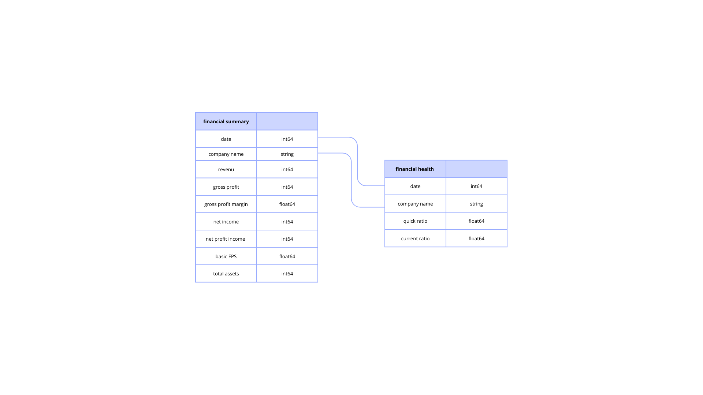
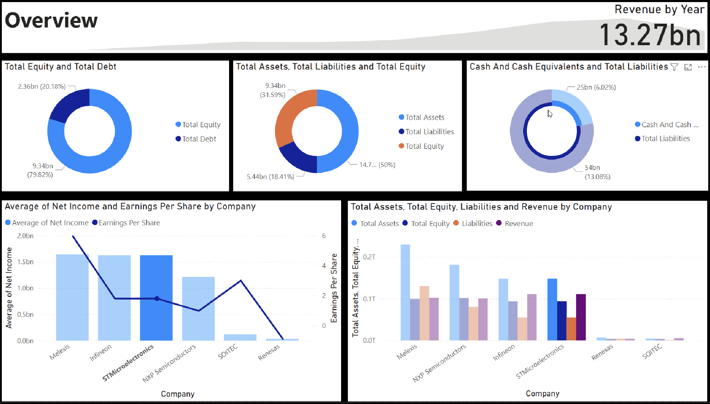

# Project Background
STMicroelectronics, fondée en 1987, est une entreprise mondiale de semi-conducteurs qui conçoit et fabrique une large gamme de composants électroniques pour les secteurs automobile, industriel et grand public. Elle opère à l’échelle internationale avec un modèle intégré verticalement, assurant un bon contrôle de la production et de la chaîne d’approvisionnement.

Ce projet analyse les données financières publiées de STMicroelectronics — telles que les revenus, la rentabilité, et les dépenses en R&D — et les compare à celles de concurrents comme Texas Instruments, NXP et Infineon. L’objectif est de dégager des insights clés sur la performance de l’entreprise et son positionnement face à la concurrence.

Des analyses et recommandations sont fournies sur les domaines clés suivants :

- **Performance des Revenus:** Analyse du chiffre d'affaires, du bénéfice brut et net, ainsi que des marges et du bénéfice par action (EPS) au fil du temps et par rapport aux concurrents.
- **Actifs et Liquidité**: Examen des ratios de liquidité, de la trésorerie et des actifs courants, ainsi que de l'évolution des actifs totaux et des passifs.
- **Capitaux Propres et Structure Financière:** Évaluation des capitaux propres, du nombre d'actions et de la structure dette/fonds propres pour mesurer la solidité financière de l'entreprise. 

Les scripts Python utilisés pour fusionner plusieurs ensembles de données en une table unique et propre, ainsi que pour extraire des informations pertinentes pour l’analyse, sont disponibles ici [lien].

Le code Python ciblé, répondant à diverses questions commerciales et permettant d’extraire des indicateurs clés à partir des données, est disponible ici [lien].

Un tableau de bord interactif réalisé sur Power BI, permettant de visualiser et d’explorer la performance financière et les comparaisons sectorielles, est accessible ici [lien].

# Structure des données & vérifications initiales

La base de données principale du projet est composée initialement de six tables distinctes, chacune contenant des résumés financiers de différentes entreprises sur une période de 10 ans, téléchargés depuis le site Morningstar.

Dans un premier temps, les six tables ont été fusionnées pour former une seule table consolidée regroupant les indicateurs financiers clés. Ensuite, une deuxième série de six tables, cette fois-ci portant sur la santé financière des mêmes entreprises, a également été fusionnée de manière similaire.

Enfin, ces deux tables consolidées ont été jointes ensemble pour créer la base de données finale utilisée dans l’analyse. Cette base complète intègre à la fois les performances financières et les indicateurs de solidité financière pour chaque entreprise, sur une période de 10 ans.

# Synthèse du Rapport

### Aperçu des Résultats

STMicroelectronics affiche un revenu net moyen d’environ 1,6 milliard d’euros, ce qui le place juste derrière Melexis et Infineon, confirmant une forte rentabilité. Son bénéfice par action (EPS) est d’environ 3,5, un niveau intermédiaire comparé à Melexis (~5,5) et bien supérieur à celui de Renesas ou SOITEC. En termes d’actifs totaux, l’entreprise dispose d’environ 0,17 milliard d’euros, et ses capitaux propres s’élèvent à près de 0,09 milliard, ce qui représente un bon équilibre entre solidité financière et capacité d’investissement. Sa dette totale reste modérée, participant à une structure financière saine. Comparé à la moyenne sectorielle, STMicroelectronics démontre une performance robuste et équilibrée, à la fois en termes de rentabilité et de structure bilancielle.

# Insights Deep Dive
### Category 1:

* **Croissance des revenus en retrait en 2024 : ** Alors que l'industrie a connu une forte croissance en 2024, STMicroelectronics a vu ses revenus annuels chuter de 23,2%, indiquant des défis spécifiques contrairement à l'expansion sectorielle.
  
* **Pression sur la marge brute : ** La marge brute de STMicro en 2024 (39,3%) et les prévisions en baisse pour le T1 2025 (33,8%) suggèrent des difficultés à maintenir la rentabilité par rapport à l'industrie favorisée par la forte demande (mémoire, IA).
  
* **Main insight 3.** More detail about the supporting analysis about this insight, including time frames, quantitative values, and observations about trends.
  
* **Main insight 4.** More detail about the supporting analysis about this insight, including time frames, quantitative values, and observations about trends.

[Visualization specific to category 1]

### Category 2:

* **Main insight 1.** More detail about the supporting analysis about this insight, including time frames, quantitative values, and observations about trends.
  
* **Main insight 2.** More detail about the supporting analysis about this insight, including time frames, quantitative values, and observations about trends.
  
* **Main insight 3.** More detail about the supporting analysis about this insight, including time frames, quantitative values, and observations about trends.
  
* **Main insight 4.** More detail about the supporting analysis about this insight, including time frames, quantitative values, and observations about trends.

[Visualization specific to category 2]

### Category 3:

* **Main insight 1.** More detail about the supporting analysis about this insight, including time frames, quantitative values, and observations about trends.
  
* **Main insight 2.** More detail about the supporting analysis about this insight, including time frames, quantitative values, and observations about trends.
  
* **Main insight 3.** More detail about the supporting analysis about this insight, including time frames, quantitative values, and observations about trends.
  
* **Main insight 4.** More detail about the supporting analysis about this insight, including time frames, quantitative values, and observations about trends.

[Visualization specific to category 3]

### Category 4:

* **Main insight 1.** More detail about the supporting analysis about this insight, including time frames, quantitative values, and observations about trends.
  
* **Main insight 2.** More detail about the supporting analysis about this insight, including time frames, quantitative values, and observations about trends.
  
* **Main insight 3.** More detail about the supporting analysis about this insight, including time frames, quantitative values, and observations about trends.
  
* **Main insight 4.** More detail about the supporting analysis about this insight, including time frames, quantitative values, and observations about trends.

[Visualization specific to category 4]

# Recommendations:

Based on the insights and findings above, we would recommend the [stakeholder team] to consider the following: 

* Specific observation that is related to a recommended action. **Recommendation or general guidance based on this observation.**
  
* Specific observation that is related to a recommended action. **Recommendation or general guidance based on this observation.**
  
* Specific observation that is related to a recommended action. **Recommendation or general guidance based on this observation.**
  
* Specific observation that is related to a recommended action. **Recommendation or general guidance based on this observation.**
  
* Specific observation that is related to a recommended action. **Recommendation or general guidance based on this observation.**
  

# Assumptions and Caveats:

Throughout the analysis, multiple assumptions were made to manage challenges with the data. These assumptions and caveats are noted below:

* Assumption 1 (ex: missing country records were for customers based in the US, and were re-coded to be US citizens)
  
* Assumption 1 (ex: data for December 2021 was missing - this was imputed using a combination of historical trends and December 2020 data)
  
* Assumption 1 (ex: because 3% of the refund date column contained non-sensical dates, these were excluded from the analysis)
